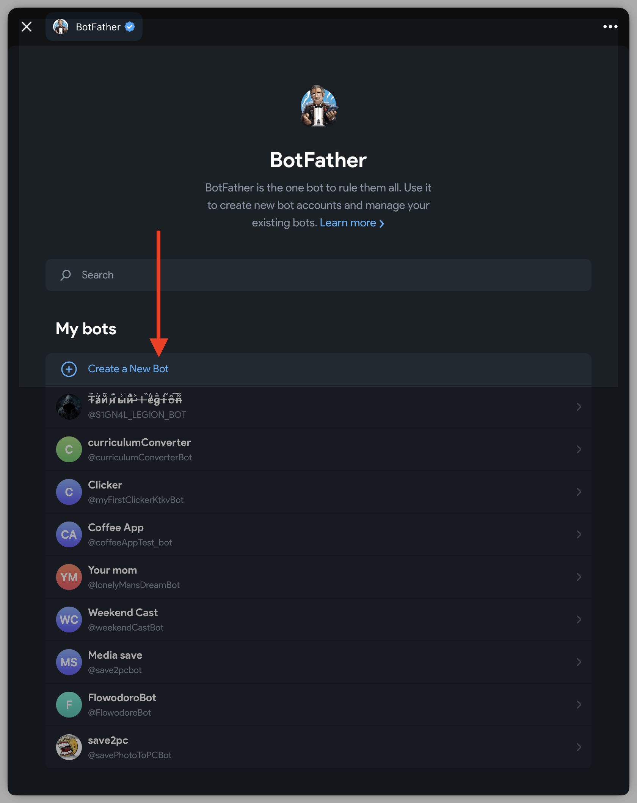
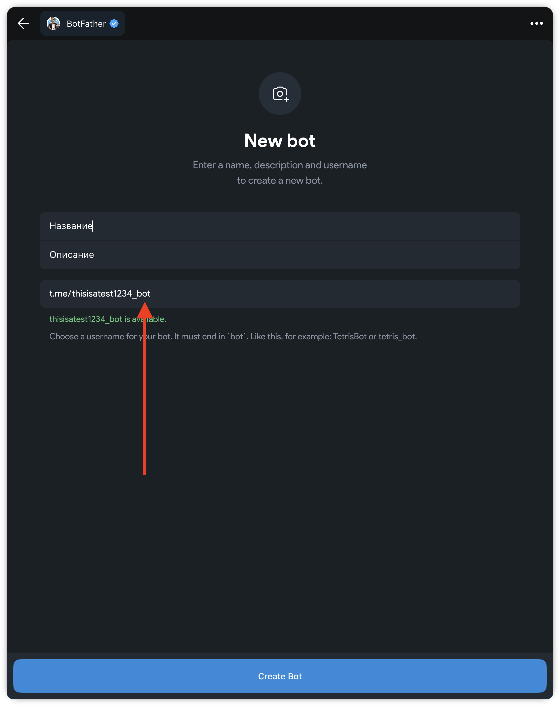
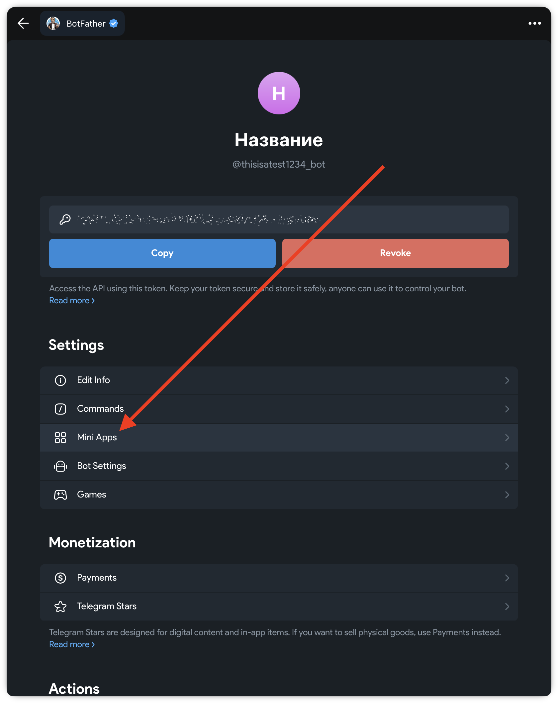
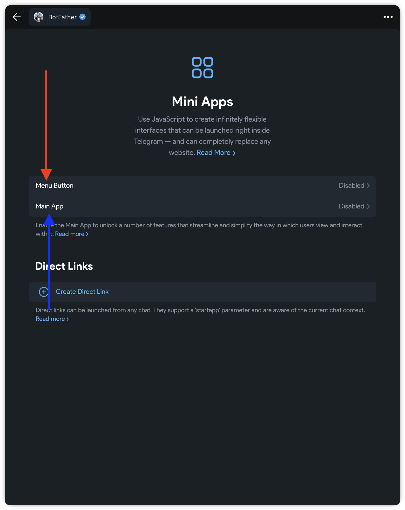
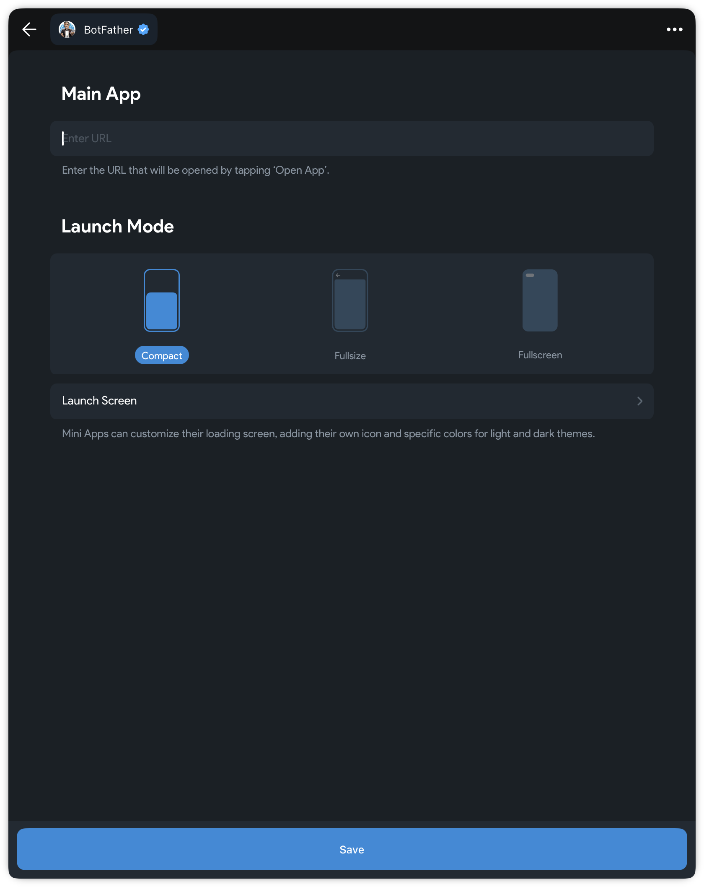

# Использование API

# КАК ДЕЛАТЬ РАБОТУ

1. Форкните свою прошлую работу с названием `mobdev-lab12-ваша_фамилия`

_Уберите галочку, чтобы форкался не только `main`_

2. Сделайте пуллреквест из `wip/dev` в `main` и сами закройте его

_Далее работайте в `wip/dev`_

3. Удалите содержимое файла `README.md` и вставьте туда тэг вашего бота

4. В конце также поднимите приложение и сделайте PR из второй ветки в `main` и не закрывайте PR

## Описание проекта

Необходимо создать React-приложение с использованием React Router (подумайте, что у приложение должно быть больше 1 функции), а также с использованием API вашего выбора (смотрите ниже в документации)

## Алгоритм создания бота

Откройте Web-приложение бота @BotFather



---

Создайте бота

- Название
- Описание
- Тэг бота

_Обратите внимание, что тэг должен заканчиваться либо на `_bot`, либо на `Bot`_



---

Зайдите в настройки MiniApp вашего бота



---

__Menu Button__ - кнопка меню, обычно она вызывает inline клавиатуру и в данном случае можно вызывать приложение через него, но тогда придется настраивать его через сам сайт

__MainApp__ - кнопка приложения



---

Как URL введите ссылку на то, где захосчен ваш сайт



_Настройку приложения можно не проводить, так как мы будем делать это через код_

## Алгоритм подключения Telegram модуля в приложение

## Часть 1: Установка и подключение Telegram Web App SDK

### Шаг 1: Установка npm пакета

Откройте терминал в корневой папке вашего проекта и выполните команду:

```bash
npm install @twa-dev/sdk
```

## Часть 2: Создание Telegram Wrapper

### Шаг 2: Создание контекста для Telegram Web App

Создайте файл `src/context/TelegramContext.jsx`:

```javascript
import { createContext, useContext, useEffect, useState } from 'react';
import WebApp from '@twa-dev/sdk';

const TelegramContext = createContext({});

export const useTelegram = () => {
  const context = useContext(TelegramContext);
  if (!context) {
    throw new Error('useTelegram должен использоваться внутри TelegramProvider');
  }
  return context;
};

export const TelegramProvider = ({ children }) => {
  const [webApp] = useState(WebApp);
  const [user, setUser] = useState(null);

  useEffect(() => {
    // Инициализируем Telegram Web App
    WebApp.ready();
    
    // Получаем данные пользователя
    const tgUser = WebApp.initDataUnsafe?.user;
    if (tgUser) {
      setUser(tgUser);
    }
    
    // 1. Расширяем приложение на весь экран
    WebApp.expand();
    
    // 2. Отключаем свайп вниз для закрытия приложения
    WebApp.disableVerticalSwipes();
    
    // 3. Настраиваем цвета приложения
    WebApp.setHeaderColor('#1a1a1a'); // Цвет шапки (темно-серый)
    WebApp.setBackgroundColor('#ffffff'); // Цвет фона (белый)
    
    // Или используйте системные цвета Telegram:
    // WebApp.setHeaderColor('bg_color');
    // WebApp.setBackgroundColor('secondary_bg_color');
    
    // 4. Применяем тему Telegram к CSS переменным
    applyTelegramTheme();
    
    console.log('Telegram Web App инициализирован');
    console.log('Пользователь:', tgUser);
    console.log('Версия:', WebApp.version);
    console.log('Платформа:', WebApp.platform);
    console.log('Цветовая схема:', WebApp.colorScheme);
    
  }, []);

  const applyTelegramTheme = () => {
    const themeParams = WebApp.themeParams;
    
    if (themeParams) {
      document.documentElement.style.setProperty(
        '--tg-theme-bg-color', 
        themeParams.bg_color || '#ffffff'
      );
      document.documentElement.style.setProperty(
        '--tg-theme-text-color', 
        themeParams.text_color || '#000000'
      );
      document.documentElement.style.setProperty(
        '--tg-theme-hint-color', 
        themeParams.hint_color || '#999999'
      );
      document.documentElement.style.setProperty(
        '--tg-theme-link-color', 
        themeParams.link_color || '#2481cc'
      );
      document.documentElement.style.setProperty(
        '--tg-theme-button-color', 
        themeParams.button_color || '#2481cc'
      );
      document.documentElement.style.setProperty(
        '--tg-theme-button-text-color', 
        themeParams.button_text_color || '#ffffff'
      );
      document.documentElement.style.setProperty(
        '--tg-theme-secondary-bg-color', 
        themeParams.secondary_bg_color || '#f0f0f0'
      );
    }
  };

  const value = {
    webApp,
    user,
    // Полезные методы для использования в компонентах
    showAlert: (message) => WebApp.showAlert(message),
    showConfirm: (message, callback) => WebApp.showConfirm(message, callback),
    showPopup: (params, callback) => WebApp.showPopup(params, callback),
    sendData: (data) => WebApp.sendData(data),
    close: () => WebApp.close(),
    // Haptic Feedback
    haptic: {
      impact: (style) => WebApp.HapticFeedback.impactOccurred(style),
      notification: (type) => WebApp.HapticFeedback.notificationOccurred(type),
      selection: () => WebApp.HapticFeedback.selectionChanged()
    }
  };

  return (
    <TelegramContext.Provider value={value}>
      {children}
    </TelegramContext.Provider>
  );
};
```

### Шаг 3: Обновление файла main.jsx

Откройте файл `src/main.jsx` и оберните `RouterProvider` в `TelegramProvider`:

```javascript
import React from 'react'
import ReactDOM from 'react-dom/client'
import { RouterProvider } from 'react-router-dom'
import { router } from './router'
import { TelegramProvider } from './context/TelegramContext'
import './index.css'

ReactDOM.createRoot(document.getElementById('root')).render(
  <React.StrictMode>
    <TelegramProvider>
      <RouterProvider router={router} />
    </TelegramProvider>
  </React.StrictMode>,
)
```

### Шаг 4: Обновление CSS для темы Telegram

Откройте или создайте файл `src/index.css` и добавьте CSS переменные:

_Не забудьте его подключить в index.jsx_

```jsx
import './index.css'
```

```css
/* CSS переменные Telegram */
:root {
  --tg-theme-bg-color: #ffffff;
  --tg-theme-text-color: #000000;
  --tg-theme-hint-color: #999999;
  --tg-theme-link-color: #2481cc;
  --tg-theme-button-color: #2481cc;
  --tg-theme-button-text-color: #ffffff;
  --tg-theme-secondary-bg-color: #f0f0f0;
}
```

### Шаг 5: Поменяйте все цвета на переменные цвета телеграмма юзера

```css
color: #ff12cd;
```

на

```css
color: var(--tg-theme-link-color);
```

### Шаг 6: [Залейте на GH pages](https://github.com/41ISP/mobdev-index?tab=readme-ov-file#%D0%BA%D0%B0%D0%BA-%D1%85%D0%BE%D1%81%D1%82%D0%B8%D1%82%D1%8C-react-%D1%80%D0%B0%D0%B1%D0%BE%D1%82%D1%83) и обновите ссылку в `BotFather`

# Как сдавать

- Создайте форк репозитория в организации 41ISP с названием webdev-6-вашафамилия
- Используя ветку wip сделайте задание
- Зафиксируйте изменения в вашем репозитории
- Когда документ будет готов - создайте пул реквест из ветки wip (вашей) на ветку main (тоже вашу) и укажите меня (ktkv419) как reviewer

Не мержите сами коммит, это сделаю я после проверки задания
